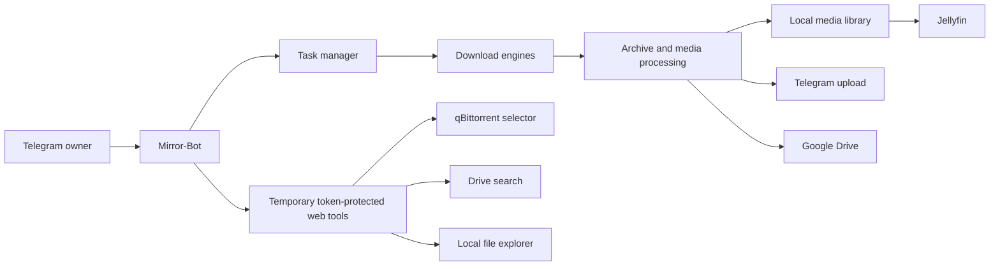

# Mirror-Bot

  

A private, owner-controlled Telegram bot for downloading, processing, organizing, and delivering files across local storage, Telegram, and Google Drive.

Mirror-Bot combines multiple transfer engines behind one `/add` workflow, provides live task status and reliable cancellation, organizes media for Jellyfin, and exposes temporary token-protected web tools for torrent selection, Drive search, and local file management.

> Mirror-Bot is designed for personal infrastructure. Use it only with content you are authorized to access, download, and distribute.

## Highlights

- **One download command** for direct links, Telegram files, magnets, torrents, Google Drive links, and yt-dlp-supported media.
- **Three destinations:** local media library, Telegram, or Google Drive.
- **Built-in processing:** ZIP creation, password-protected ZIPs, archive extraction, and password-protected extraction.
- **Torrent file selection:** temporary tree-based selector with check-all, uncheck-all, and cancellation.
- **Smart media organization:** optional TMDb matching produces Jellyfin-friendly movie, series, and season folders.
- **Managed Jellyfin companion:** inspect, start, stop, restart, open, and scan Jellyfin from Telegram.
- **Temporary local file explorer:** browse, download, rename, copy, move, delete, upload to Telegram, and request a Jellyfin scan.
- **Google Drive management:** upload, download, search, temporary public sharing, quota inspection, and deletion through the official Drive API.
- **Reliable task lifecycle:** live status, owner-only access, cancellation, graceful shutdown, disk protection, cleanup, and stalled-transfer detection.

## Supported Sources

| Source | Behavior |
| --- | --- |
| Direct HTTP/HTTPS links | Streamed download with filename and size detection |
| Direct-host links | Resolves supported hosts before downloading |
| Telegram files | Download by replying to a file with `/add` |
| Magnet links and `.torrent` files | qBittorrent download with temporary file selector |
| Google Drive files and folders | Download through the official Google Drive API |
| yt-dlp-supported URLs | Video resolution or MP3 quality selection |

Built-in direct-host resolvers currently include redirect/shortener links, MediaFire, PixelDrain, WeTransfer, OneDrive, GoFile, SolidFiles, Upload.ee, StreamTape, pCloud, Send.cm, KrakenFiles, 1Fichier, Racaty, DoodStream, and Linkbox.

## Destinations

### Local Library

Local downloads are organized into `movies` or `series`. With a TMDb API key, Mirror-Bot resolves confident title matches and creates Jellyfin-friendly paths:

```text
movies/Movie Name (Year)/original-file-name.mkv
series/Series Name (Year)/Season 01/original-episode-name.mkv
```

Original filenames are preserved. Existing files are never silently overwritten, and Jellyfin receives a library refresh request after successful local delivery.

### Telegram

Files are uploaded back to the owner chat. Media-compatible files are sent as media, large files are split automatically at Telegram's configured limit, and completion messages summarize the uploaded result.

### Google Drive

Files and folders can be downloaded from or uploaded to Google Drive using OAuth credentials and the official Drive API. Mirror-Bot also provides temporary browser-based Drive search results, five-minute public folder share pages, and Drive item deletion.

## Architecture



The bot and qBittorrent run together in the `mirror-bot` container. Jellyfin runs in its own `jellyfin` container and stores persistent configuration under `data/jellyfin/`.

## Requirements

- Linux server or VPS with Docker Engine and Docker Compose
- Telegram bot token from [BotFather](https://t.me/BotFather)
- Telegram API ID and API hash from [my.telegram.org](https://my.telegram.org)
- Public TCP access to the temporary web-tool ports when browser access is required
- Optional Google OAuth credentials, Jellyfin API key, and TMDb API key

The Docker image includes Python 3.12, qBittorrent-nox, FFmpeg, 7-Zip, UnRAR, Deno, yt-dlp, and the required Python packages. ARM64 and AMD64 hosts are supported when the upstream base images and packages are available for the platform.

## Quick Start

### 1. Clone the repository

```bash
git clone https://github.com/hitesh920/Mirror-Bot.git
cd Mirror-Bot
```

### 2. Create the environment file

```bash
cp .env.example .env
```

Configure at least the required Telegram values:

```dotenv
BOT_TOKEN=your_bot_token
OWNER_ID=your_numeric_telegram_user_id
TELEGRAM_API_ID=your_api_id
TELEGRAM_API_HASH=your_api_hash

# The default Compose file mounts ./downloads at /media inside the bot.
LOCAL_DOWNLOAD_ROOT=/media
```

Create the host download directory if it does not already exist:

```bash
mkdir -p downloads
touch credentials.json token.pickle
```

### 3. Start the services

```bash
docker compose up -d --build
```

Check service state and logs:

```bash
docker compose ps
docker compose logs -f bot
```

Jellyfin is available at:

```text
http://SERVER_IP:8002
```

## Configuration

| Variable | Required | Default | Description |
| --- | --- | --- | --- |
| `BOT_TOKEN` | Yes | - | Telegram bot token |
| `OWNER_ID` | Yes | - | Numeric Telegram user ID allowed to control the bot |
| `TELEGRAM_API_ID` | Yes | - | Telegram API application ID |
| `TELEGRAM_API_HASH` | Yes | - | Telegram API application hash |
| `LOCAL_DOWNLOAD_ROOT` | Yes | - | Local destination path inside the bot container; use `/media` with the default Compose file |
| `GOOGLE_DRIVE_FOLDER_ID` | No | Empty | Default Google Drive upload folder ID |
| `TASK_LIMIT` | No | `10` | Maximum number of concurrently active tasks |
| `STATUS_UPDATE_INTERVAL` | No | `10` | Live status refresh interval in seconds |
| `TORRENT_SELECTION_PORT` | No | `8000` | Torrent selector port; Drive search uses the next port |
| `TORRENT_SELECTION_TIMEOUT` | No | `300` | Torrent metadata/file-selection timeout in seconds |
| `PUBLIC_BASE_URL` | No | Auto-detected | Emergency override for generated public links |
| `JELLYFIN_API_KEY` | No | Empty | Enables Jellyfin server information and library scans |
| `TMDB_API_KEY` | No | Empty | Enables confident official movie/series title matching |
| `TZ` | No | `Asia/Kolkata` | Jellyfin container timezone |

Internal defaults intentionally remain in code: Telegram split size is 2 GB, yt-dlp video quality is capped at 1080p, MP3 quality supports up to 320 kbps, and ZIP compression uses level 5.

## Ports

| Port | Service | Exposure behavior |
| --- | --- | --- |
| `8000` | Torrent file selector | Opens temporarily while selection is pending |
| `8001` | Google Drive search results | Temporary token-protected result pages |
| `8002` | Jellyfin | Persistent Jellyfin web interface |
| `8003` | Local file explorer | Opens while one or more temporary sessions exist |
| `8004` | Google Drive share pages | Opens while one or more temporary shares exist |

Generated temporary pages use random tokens and expire automatically. Restrict ingress to trusted IP ranges whenever practical.

## Commands

| Command | Description |
| --- | --- |
| `/add <link>` | Detect the source and begin the destination workflow |
| `/add` as a reply | Download a replied Telegram file or link |
| `/status` | Show live active-task status |
| `/stats` | Show bot and server resource statistics |
| `/cancel <task-id>` | Cancel one active task |
| `/cancelall` | Cancel all active and pending tasks |
| `/search <name>` | Search Google Drive on a temporary results page |
| `/share <drive-link>` | Open a five-minute page for an already-public Drive file or folder |
| `/delete [drive-link-or-id]` | Delete a Google Drive item with confirmation |
| `/gdstats` | Show Google Drive authentication and storage quota |
| `/local` | Open the temporary local file explorer |
| `/jellyfin` | Open the Jellyfin management menu |
| `/logs` | Send the latest 2,000 sanitized application log lines |
| `/restart` | Gracefully restart Mirror-Bot |
| `/ping` | Check whether the bot is responsive |
| `/help` | Show the command reference in Telegram |

All commands and callback actions are restricted to `OWNER_ID`.

## `/add` Options

Options work with a link or with a replied Telegram file:

```text
/add <link> -z
/add <link> -zp "zip password"
/add <link> -e
/add <link> -ep "archive password"
/add <link> -n "custom name"
```

| Option | Description |
| --- | --- |
| `-z` | Create a ZIP archive before delivery |
| `-zp <password>` | Create a password-protected ZIP archive |
| `-e` | Extract an archive before delivery |
| `-ep <password>` | Extract a password-protected archive |
| `-n <name>` | Set a custom task name |

For yt-dlp URLs, the bot first asks for **Video** or **Audio**. Video offers resolutions up to 1080p with audio; audio offers MP3 quality choices up to 320 kbps.

## Google Drive Setup

1. Create an OAuth desktop application in Google Cloud and download its credentials as `credentials.json`.
2. Place `credentials.json` in the repository root.
3. Build a temporary helper image and generate `token.pickle`:

```bash
rm -f token.pickle
docker build -t mirror-bot-token-helper .
docker run --rm -it \
  -v "$(pwd):/work" -w /work mirror-bot-token-helper \
  python scripts/generate_drive_token.py \
  --credentials credentials.json \
  --token token.pickle
```
4. Set `GOOGLE_DRIVE_FOLDER_ID` in `.env` if uploads should use a default folder.
5. Start or recreate the bot:


```bash
docker compose up -d --build bot
```

Both credential files are ignored by Git and must never be committed.

## Jellyfin Integration

Jellyfin is managed as a companion service:

- Persistent configuration: `data/jellyfin/config/`
- Persistent cache: `data/jellyfin/cache/`
- Read-only media mount: `/media`
- Public interface: `http://SERVER_IP:8002`

The `/jellyfin` menu can show status, open Jellyfin, start, stop, restart, refresh, and scan the library. Mirror-Bot accesses only the configured `jellyfin` container through the Docker socket.

Jellyfin accounts, settings, metadata, and library configuration survive container rebuilds. They are lost only if `data/jellyfin/` is deleted.

## Local File Explorer

Use `/local` to open a token-protected browser session rooted strictly inside the configured download library. It supports:

- Breadcrumb browsing and file downloads
- Folder creation and renaming
- Copy and move operations
- Permanent deletion with confirmation
- Recursive Telegram uploads
- Jellyfin library scans

Sessions expire after five minutes. A browser prompt appears before expiry and can extend the session by another five minutes. Path traversal, symbolic links, and operations outside the download root are rejected.

## Smart Library Migration

Preview how existing local media would be reorganized:

```bash
docker compose run --rm --no-deps bot python scripts/migrate_local_library.py
```

Apply the migration:

```bash
docker compose run --rm --no-deps bot python scripts/migrate_local_library.py --apply
```

The migration moves only confident TMDb matches, refuses conflicts, preserves uncertain items, applies writable media permissions, and requests one Jellyfin scan after completion.

## Reliability And Safety

Mirror-Bot includes safeguards for long-running unattended operation:

- Every task ends in exactly one terminal state: complete, failed, or cancelled.
- Cancellation is idempotent and propagates to downloads, uploads, selectors, qBittorrent, and archive subprocesses.
- Docker `SIGTERM`/`SIGINT` triggers graceful shutdown and waits up to 30 seconds for cleanup.
- Active qBittorrent work and partial task workspaces are cleaned after cancellation or failure.
- Known-size writes are checked before they begin; unknown-size writes are monitored while running.
- Each destination filesystem preserves the larger of 5 GiB or 5% free space.
- Downloads and uploads fail clearly after ten minutes without meaningful progress.
- Temporary task directories isolate filenames and are removed after terminal task states.

## Operations

```bash
# Follow bot logs
docker compose logs -f bot

# Restart only Mirror-Bot
docker compose restart bot

# Restart Jellyfin
docker compose restart jellyfin

# Stop all services
docker compose down

# Rebuild after code or dependency changes
docker compose up -d --build
```

Downloaded media and Jellyfin state persist through normal container restarts and rebuilds because they live in mounted host directories.

Application logs are written to `data/logs/bot.log`, sanitized before storage,
rotated at 5 MB, and retained for up to seven days within an approximately
50 MB limit. Engine logs such as qBittorrent remain separate and are never
included in `/logs`. Docker also rotates console logs for both services.

## Security Notes

- Keep `.env`, `credentials.json`, `token.pickle`, logs, and `data/` private.
- Never commit Telegram tokens, Google credentials, Jellyfin API keys, or TMDb API keys.
- Restrict ports `8000`, `8001`, `8002`, and `8003` using your cloud firewall where possible.
- The Docker socket gives Mirror-Bot privileged access to manage Jellyfin. Run only trusted code and review changes before deployment.
- Temporary web pages are token-protected, but public exposure should still be limited to trusted networks or IP addresses.

## Project Status

Mirror-Bot currently supports the complete local, Telegram, Google Drive, torrent, archive-processing, smart-library, Jellyfin, and reliability workflows described above. Rclone integration is intentionally not included.
