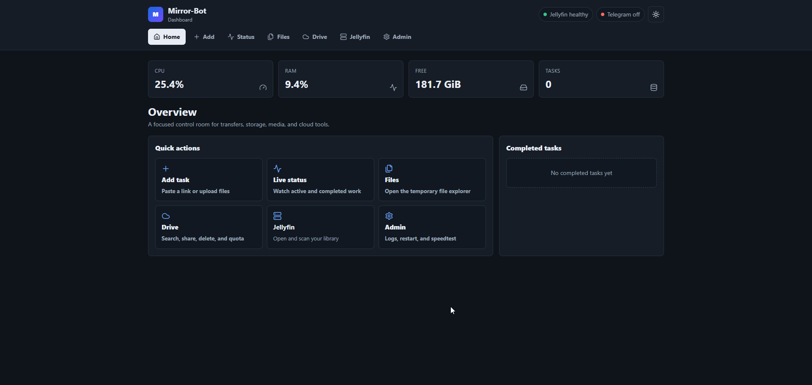
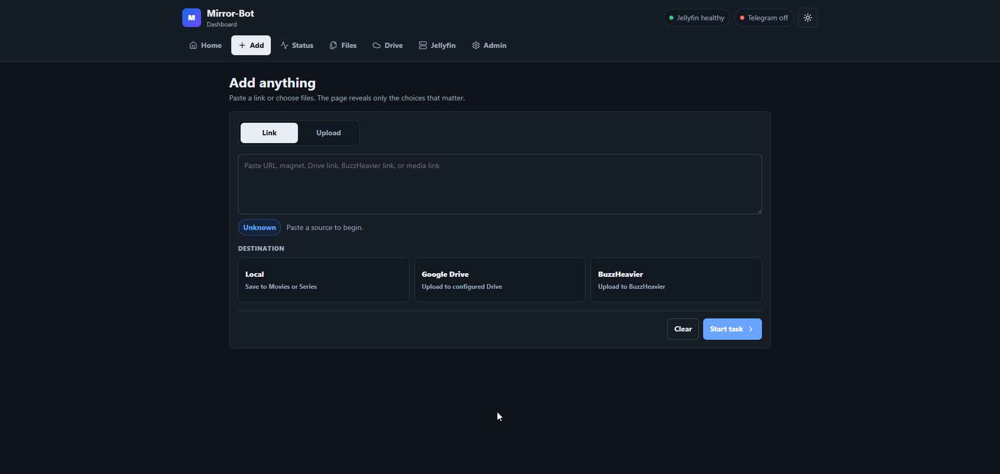
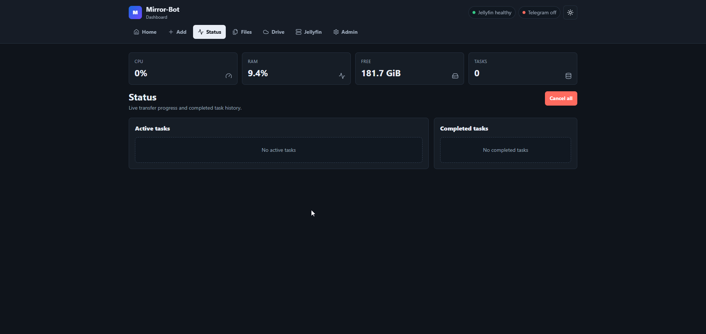
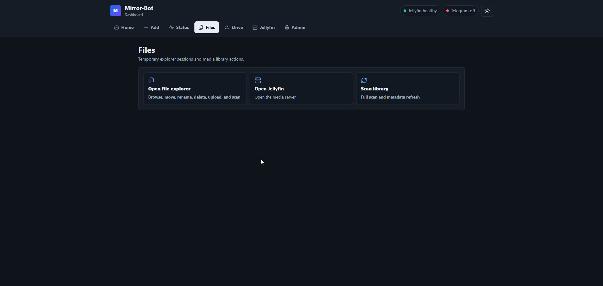
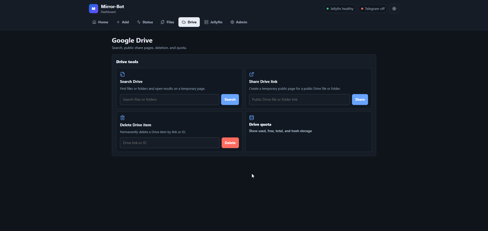
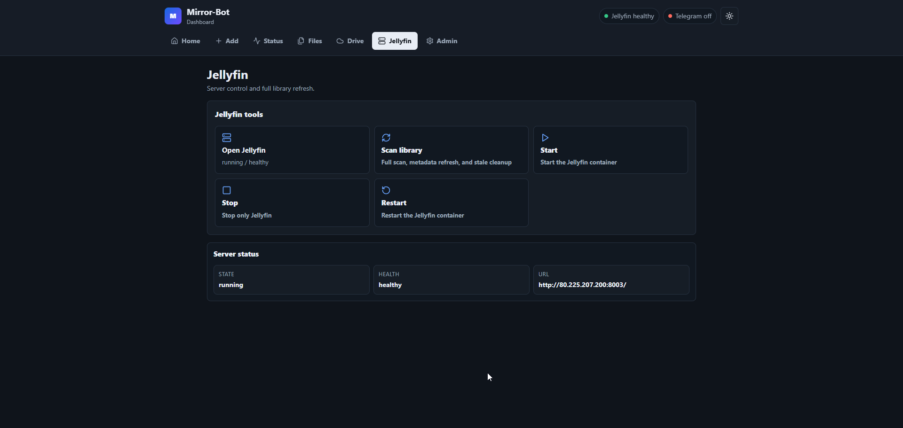
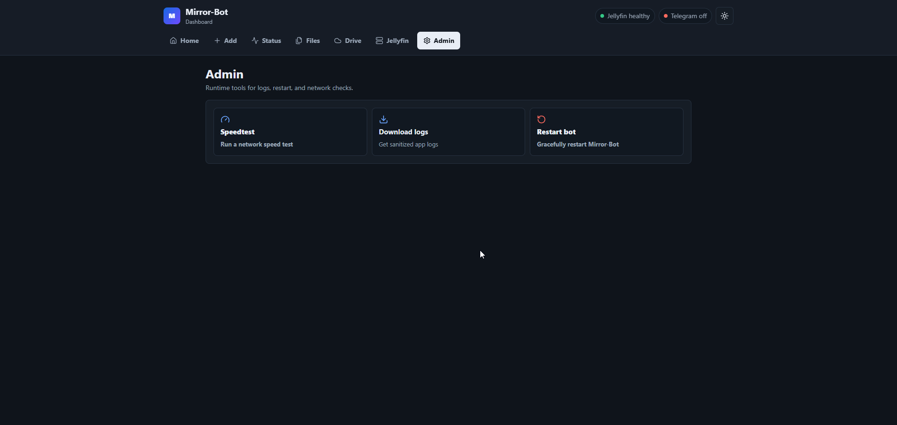

<div align="center">

# Mirror-Bot

A private web dashboard and Telegram-aware transfer manager for downloading, processing, organizing, and delivering files across local storage, Google Drive, Telegram, BuzzHeavier, and Jellyfin.


</div>

> Mirror-Bot is built for personal infrastructure. Use it only with content you are allowed to access, download, store, and share.

## Preview



<details>
<summary>More dashboard screenshots</summary>

### Add anything


### Live status


### Files


### Google Drive


### Jellyfin


### Admin


</details>

## What It Does

Mirror-Bot gives you one control room for transfer work:

- Add direct links, magnets, torrents, Google Drive links, BuzzHeavier links, yt-dlp links, and browser uploads.
- Choose a destination: local media library, Google Drive, Telegram, or BuzzHeavier.
- Track live progress, speed, size, ETA, phase, and completed tasks from the web dashboard.
- Organize local movies and series into Jellyfin-friendly folders using filename parsing and optional TMDb matching.
- Manage a companion Jellyfin container from the dashboard.
- Open temporary self-hosted pages for torrent file selection, local file management, Drive search, and Drive sharing.
- Run admin actions like sanitized log download, speedtest, and graceful restart.

## Dashboard Sections

| Section | Purpose |
| --- | --- |
| Home | Resource cards, quick actions, and recent completed work |
| Add | Smart single-box workflow for links and browser uploads |
| Status | Active transfers, completed tasks, progress, ETA, and cancellation |
| Files | Temporary local file explorer and Jellyfin scan actions |
| Drive | Search, share, delete, and quota tools for Google Drive |
| Jellyfin | Open, scan, start, stop, and restart the managed Jellyfin service |
| Admin | Speedtest, sanitized logs, and Mirror-Bot restart |

## Supported Sources

| Source | Notes |
| --- | --- |
| Direct HTTP/HTTPS links | Downloads with filename and size detection where available |
| Direct host links | Uses built-in resolvers for supported hosts |
| Magnet and torrent links | qBittorrent-powered download with temporary file selector |
| Google Drive files/folders | Downloaded through the official Google Drive API |
| yt-dlp links | Video or audio choices, with video up to 1080p and MP3 up to 320 kbps |
| Telegram files | Available when Telegram UI/session support is enabled |
| BuzzHeavier | Can be used as a source or upload destination |

## Destinations

### Local Media Library

Local delivery is designed for Jellyfin:

```text
movies/Movie Name (Year)/original-file-name.mkv
series/Series Name (Year)/Season 01/original-episode-name.mkv
```

The bot keeps original media filenames, avoids overwriting existing files, applies writable media permissions, and triggers Jellyfin scan/metadata refresh after local batches complete.

### Google Drive

Google Drive support uses OAuth and the official Drive API for upload, download, search, share-page generation, quota, and deletion.

### Telegram

When Telegram is enabled, Mirror-Bot can upload results back to Telegram, split large files, send media-compatible files as media, and use Telegram file replies as sources.

### BuzzHeavier

BuzzHeavier is available as an upload destination and source resolver. Configure `BUZZHEAVIER_ACCOUNT_ID` for authenticated uploads when required.

## Temporary Web Tools

| Tool | Port | Behavior |
| --- | --- | --- |
| Main dashboard | `8000` | Persistent authenticated web app, disabled when `ENABLE_WEB_UI=false` |
| Torrent selector | `8001` | Opens only while a torrent waits for file selection |
| Drive search page | `8002` | Tokenized temporary search result page |
| Jellyfin | `8003` | Persistent Jellyfin web UI |
| Local file explorer | `8004` | Tokenized temporary file manager |
| Drive share page | `8005` | Tokenized temporary public share page |

Temporary pages use random tokens and expire automatically. For public VPS deployments, open only the ports you need and prefer restrictive firewall rules.

## Quick Start

### 1. Clone

```bash
git clone https://github.com/hitesh920/Mirror-Bot.git
cd Mirror-Bot
```

### 2. Configure

```bash
cp .env.example .env
mkdir -p downloads data/logs data/downloads
```

Edit `.env`:

```dotenv
BOT_TOKEN=your_bot_token
OWNER_ID=your_numeric_telegram_user_id
TELEGRAM_API_ID=your_api_id
TELEGRAM_API_HASH=your_api_hash

WEB_USERNAME=admin
WEB_PASSWORD=change_this_password
LOCAL_DOWNLOAD_ROOT=/media
```

For a web-only setup, keep Telegram command UI disabled:

```dotenv
ENABLE_TELEGRAM_UI=false
ENABLE_WEB_UI=true
```

For Telegram-only operation, disable the main dashboard and keep the bot UI enabled:

```dotenv
ENABLE_TELEGRAM_UI=true
ENABLE_WEB_UI=false
```

### 3. Optional Google Drive Files

Place these in the repository root if you want Drive features:

```text
credentials.json
token.pickle
```

Both files are secrets. Do not commit them.

### 4. Start

```bash
docker compose up -d --build
```

Open the dashboard:

```text
http://SERVER_IP:8000
```

Open Jellyfin:

```text
http://SERVER_IP:8003
```

## Configuration Reference

| Variable | Required | Default | Description |
| --- | --- | --- | --- |
| `BOT_TOKEN` | Telegram mode | Empty | Telegram bot token |
| `OWNER_ID` | Telegram mode | Empty | Telegram user ID allowed to control the bot |
| `TELEGRAM_API_ID` | Telegram mode | Empty | Telegram API app ID |
| `TELEGRAM_API_HASH` | Telegram mode | Empty | Telegram API app hash |
| `WEB_USERNAME` | Web dashboard | Empty | Dashboard login username |
| `WEB_PASSWORD` | Web dashboard | Empty | Dashboard login password |
| `WEB_PORT` | No | `8000` | Main dashboard port |
| `ENABLE_TELEGRAM_UI` | No | `true` | Enable Telegram command handlers |
| `LOCAL_DOWNLOAD_ROOT` | Yes | `/media` | Container path for local media output |
| `GOOGLE_DRIVE_FOLDER_ID` | Drive upload | Empty | Default Drive upload folder |
| `BUZZHEAVIER_ACCOUNT_ID` | BuzzHeavier | Empty | Optional BuzzHeavier account/token value |
| `TASK_LIMIT` | No | `10` | Maximum active task count |
| `STATUS_UPDATE_INTERVAL` | No | `10` | Status refresh interval in seconds |
| `TORRENT_SELECTION_PORT` | No | `8001` | Torrent selector base port |
| `TORRENT_SELECTION_TIMEOUT` | No | `300` | Torrent selector timeout in seconds |
| `PUBLIC_BASE_URL` | No | Auto | Override generated public URLs if auto-detect fails |
| `JELLYFIN_API_KEY` | Jellyfin scan | Empty | Jellyfin API key for scan and metadata refresh |
| `TMDB_API_KEY` | Media naming | Empty | TMDb key for movie/series title matching |
| `TZ` | No | `Asia/Kolkata` | Jellyfin timezone |

Internal defaults are intentionally kept out of `.env` unless they need to be user-tuned.

## Google Drive Token Generation

If you do not already have `token.pickle`, generate it with the helper script:

```bash
docker build -t mirror-bot-token-helper .
docker run --rm -it \
  -v "$(pwd):/work" \
  -w /work \
  mirror-bot-token-helper \
  python scripts/generate_drive_token.py \
  --credentials credentials.json \
  --token token.pickle
```

Then restart the bot:

```bash
docker compose up -d --build bot
```

## Jellyfin Integration

Jellyfin runs as a companion container named `jellyfin`.

Persistent paths:

```text
data/jellyfin/config
data/jellyfin/cache
downloads
```

Media is mounted into Jellyfin read-only as `/media`. Mirror-Bot can:

- start, stop, and restart Jellyfin;
- open Jellyfin from the dashboard;
- trigger scan and metadata refresh;
- prune stale missing media entries after local deletes and scans.

You lose Jellyfin users, settings, and metadata only if `data/jellyfin/` is deleted.

## Docker Operations

```bash
# Start or update everything
docker compose up -d --build

# Restart only Mirror-Bot
docker compose up -d --build bot

# View logs
docker compose logs -f bot

# Stop services
docker compose down

# Check status
docker compose ps
```

## Telegram Commands

Telegram commands remain available when `ENABLE_TELEGRAM_UI=true`.

| Command | Description |
| --- | --- |
| `/add <link>` | Add a link and choose destination |
| `/add` as reply | Add a replied Telegram file/link |
| `/status` | Show live task status |
| `/cancel <task-id>` | Cancel one task |
| `/cancelall` | Cancel all active and pending tasks |
| `/search <query>` | Search Google Drive on a temporary page |
| `/share <drive-link>` | Create a temporary Drive share page |
| `/delete <drive-link-or-id>` | Delete a Google Drive item |
| `/gdstats` | Show Drive quota/auth status |
| `/local` | Open temporary local file explorer |
| `/jellyfin` | Manage Jellyfin |
| `/logs` | Send sanitized recent logs |
| `/speedtest` | Run network speedtest |
| `/restart` | Gracefully restart Mirror-Bot |
| `/help` | Show command help |

All Telegram commands are owner-only.

## Processing Flags

Flags work with links and replied Telegram files:

```text
/add <link> -z
/add <link> -zp "zip password"
/add <link> -e
/add <link> -ep "archive password"
/add <link> -n "custom name"
```

| Flag | Meaning |
| --- | --- |
| `-z` | Zip after download |
| `-zp <password>` | Zip with password |
| `-e` | Extract after download |
| `-ep <password>` | Extract with password |
| `-n <name>` | Custom task/display name |

## Reliability Notes

Mirror-Bot includes:

- central task lifecycle states;
- active task limit;
- cancellation for downloads, uploads, selectors, and subprocesses;
- disk-space reserve checks;
- stalled-transfer detection;
- graceful shutdown handling;
- cleanup after success, failure, cancel, and restart;
- rotating sanitized logs;
- Docker log size limits.

## Development

```bash
# Python tests
pip install -r requirements-dev.txt
pytest

# Frontend build through Docker
docker compose build bot
```

The production Docker build compiles the React dashboard with Vite and serves the generated assets from the Python backend.

## Security Notes

- Keep `.env`, `credentials.json`, `token.pickle`, Jellyfin API keys, TMDb keys, and Telegram tokens private.
- Do not expose temporary ports publicly unless needed.
- Temporary pages are token-protected but anyone with the URL can access them until expiry.
- The bot mounts the Docker socket so it can manage only the configured Jellyfin container; deploy it only on infrastructure you control.

## Development Checks

Production containers keep dependencies lean and do not include pytest. For code changes, run checks from a local or VPS development environment:

```bash
python3 -m venv .venv
. .venv/bin/activate
pip install -r requirements-dev.txt
pytest
python -m compileall mirrorbot
cd web && npm ci && npm run build
```

If the VPS host does not have `python3-venv`, run tests in a disposable container instead:

```bash
docker compose run --rm --no-deps -v "$PWD:/app" -w /app bot \
  sh -lc 'pip install -q -r requirements-dev.txt && PYTHONPATH=/app pytest -q'
```

Runtime files such as `.env`, Google OAuth files, logs, downloads, sessions, and generated dashboard assets are intentionally ignored by git. Keep those on the server only and never commit them.

## License

No license has been declared yet. Treat this repository as private/proprietary unless a license is added.
