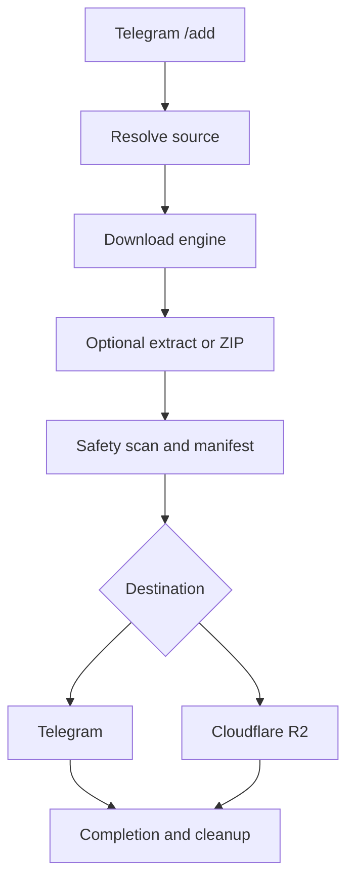

# Mirror-Bot Technical Guide

Long-term operations and maintenance reference for [`hitesh920/Mirror-Bot`](https://github.com/hitesh920/Mirror-Bot).

**Baseline:** `master` at [`ce8814c`](https://github.com/hitesh920/Mirror-Bot/commit/ce8814c34b6d59ca8f60cb9d0b09859e59b31c36), verified 17 July 2026. The Telegram bot is private and owner-only; the source repository itself is currently public.

> [!IMPORTANT]
> **Operational status as of 17 July 2026:** intentionally offline. The previous VPS instances and Mirror-Bot service are disabled. Do not run the deployment, start, or restart commands in this guide until a replacement server is ready and reactivation is explicitly intended.

## 1. Architecture and repository

### Purpose and operating model

Mirror-Bot is an asynchronous Python 3.12 service built with Kurigram/Pyrogram. A single trusted Telegram owner submits a source through `/add`, chooses a destination, watches live progress, and receives links or uploaded files. Docker Compose runs one `mirror-bot` container containing both the Python application and `qbittorrent-nox`.

Supported sources:

- Direct HTTP/HTTPS URLs and supported direct-host/shortener links
- Magnet links and `.torrent` files, with temporary browser-based file selection
- Replied Telegram documents, videos, audio, and photos
- yt-dlp-compatible video/audio links
Supported destinations are Telegram and Cloudflare R2. Optional processing includes extraction, password-protected extraction, ZIP creation, password-protected ZIP creation, and custom task names.



Tasks move through phases such as `queued`, `fetching metadata`, `selecting`, `downloading`, `preparing`, `scanning`, `extracting`, `archiving`, `uploading`, and one terminal phase: `complete`, `cancelled`, or `error`. `TASK_LIMIT` controls concurrent execution; extra accepted tasks wait for a semaphore slot. Task metadata is currently held in memory, while per-task files live under `/app/downloads/<task-id>`. Cleanup is attempted after every terminal outcome, and startup recovery removes abandoned workspaces left by an interrupted or failed cleanup.

### Repository map

```text
Mirror-Bot/
├── mirrorbot/
│   ├── app.py                 # startup, Telegram client, shared runtime state
│   ├── commands/              # thin /add, common, and R2 command handlers
│   ├── core/                  # config, models, errors, logging/redaction
│   ├── downloaders/           # direct, Telegram, torrent, yt-dlp
│   ├── resolvers/             # source recognition and link resolution
│   ├── services/              # task execution, processing, delivery, guards
│   └── telegram/              # messages, keyboards, and live status UI
├── scripts/                   # qBittorrent startup and support utilities
├── tests/                     # pytest unit and boundary tests
├── data/
│   ├── downloads/             # temporary task workspaces; not committed
│   └── logs/                  # persistent application logs; not committed
├── .env.example               # configuration template
├── docker-compose.yml         # local/VPS service definition
├── Dockerfile                 # Python, Deno, FFmpeg, 7-Zip, UnRAR, qBittorrent
├── start.sh                   # starts qBittorrent and bot; forwards signals
├── requirements.txt
├── requirements-dev.txt
└── README.md
```

| Area | Responsibility |
|---|---|
| `mirrorbot/app.py` | Loads config, creates the Telegram client and task manager, starts temporary pages, and coordinates graceful shutdown. |
| `commands/` and `telegram/` | Validate owner-only interactions and translate them into application actions. Keep business logic out of handlers. |
| `resolvers/` and `downloaders/` | Identify the source, resolve indirect links, and download into the task workspace. |
| `services/task_manager.py` | Owns tasks, concurrency, qBittorrent, selectors, cancellation, and cleanup helpers. |
| `services/task_runner.py` | Executes resolve → download → process → scan → deliver, records terminal state, and always cleans the workspace. |
| `core/logging_config.py` | Provides queued, rotating, sanitized logs and safe `/logs` exports. |

### Commands and exposed ports

All commands require `OWNER_ID`.

| Command | Purpose |
|---|---|
| `/add <link>` or replied `/add` | Start a transfer and select options/destination. |
| `/status` | Show active tasks with progress, speed, phase, and ETA. |
| `/cancel <task-id>` / `/cancelall` | Cancel one or all active tasks/selectors. |
| `/stats` / `/speedtest` | Inspect host resources or network performance. |
| `/r2stats` / `/search <name>` | Inspect R2 or return stored original upload links. |
| `/delete <key-or-link>` / `/delete all` | Permanently delete R2 uploads after confirmation. |
| `/logs` / `/restart` / `/help` | Export sanitized logs, restart gracefully, or show help. |

Only temporary, tokenized web pages are exposed:

| Host port | Page | Default lifetime |
|---:|---|---:|
| `8001` | Torrent file selector | `TORRENT_SELECTION_TIMEOUT` (300 seconds) |

These are not a persistent dashboard. Anyone who obtains a live tokenized URL can use that page until it expires. Never expose qBittorrent's internal port `8080` publicly.

## 2. Deployment and operations

### Prerequisites and configuration

Use a Linux VPS with Docker Engine and Docker Compose, enough free disk for the largest active transfers, and inbound TCP access to `8001` when torrent selection is needed. The bot also needs Telegram credentials.

```bash
git clone https://github.com/hitesh920/Mirror-Bot.git
cd Mirror-Bot
cp .env.example .env
mkdir -p data/downloads data/logs
```

For a replacement VPS, restore the encrypted production `.env` backup before starting Compose, then restrict it with `chmod 600 .env`. Do not copy old repository files over the fresh clone, and keep historical logs optional.

Required when `ENABLE_TELEGRAM_UI=true`:

| Variable | Meaning |
|---|---|
| `BOT_TOKEN` | BotFather token. |
| `OWNER_ID` | Only Telegram user ID allowed to control the bot. |
| `TELEGRAM_API_ID` | Telegram application API ID. |
| `TELEGRAM_API_HASH` | Telegram application API hash. |

Optional/runtime settings:

| Variable | Default | Meaning |
|---|---:|---|
| `TELEGRAM_DUMP_CHAT_ID` | Empty | Channel ID or `@username` for Telegram uploads; bot must be able to post. |
| `R2_ENDPOINT_URL` / `R2_BUCKET` | Empty | Cloudflare R2 S3 endpoint and private bucket. |
| `R2_ACCESS_KEY_ID` / `R2_SECRET_ACCESS_KEY` | Empty | Bucket-scoped Object Read & Write credentials. |
| `R2_PREFIX` | `uploads/` | Prefix containing all bot-managed R2 objects. |
| `R2_AUTO_DELETE_SECONDS` | `172800` | Retention period enforced by a 15-minute sweeper. |
| `CLOUDFLARE_ACCOUNT_ID` | Empty | Account ID used for `/r2stats` analytics. |
| `CLOUDFLARE_API_TOKEN` | Empty | Read-only Billing and Account Analytics API token. |
| `TASK_LIMIT` | `10` | Maximum concurrently executing tasks. |
| `STATUS_UPDATE_INTERVAL` | `10` | Telegram status refresh interval in seconds. |
| `TORRENT_SELECTION_PORT` | `8001` | Torrent selector port. |
| `TORRENT_SELECTION_TIMEOUT` | `300` | Torrent metadata/selection timeout in seconds. |
| `PUBLIC_BASE_URL` | Auto-detected | Emergency override for URLs generated by temporary pages. |
| `TZ` | `Asia/Kolkata` | Container timezone. Log timestamps remain UTC. |
| `ENABLE_TELEGRAM_UI` | `true` | Enable Telegram client and command handlers. |

Important built-in defaults include a 2 GB Telegram split size, yt-dlp video up to 1080p, MP3 at 320 kbps, ZIP level 5, qBittorrent at `localhost:8080`, and application logs at `/app/logs/bot.log`.

Never commit `.env`, sessions, `data/`, downloads, logs, tokens, cookies, or authorization material. The repository is public, so review every staged file before pushing.

Cloudflare R2 buckets remain private. Large objects use multipart uploads and
each successful object stores its original private GET link in object metadata.
Search returns that stored link and never creates a replacement. Folder uploads
also create one private HTML folder page containing every original file link.
Links are signed beyond the configured two-day retention, so users encounter
object deletion rather than a separate link-expiry window. The sweeper lists
only `R2_PREFIX`, permanently deletes objects older than the configured
retention, and resumes this policy after container restarts.

### First deployment and verification

```bash
# Validate interpolation and mounts before starting.
docker compose config

# Build and start the single service.
docker compose up -d --build

# Confirm state and watch startup.
docker compose ps
docker compose logs -f bot
```

Expected state:

- Compose shows service `bot` and container `mirror-bot` running.
- Logs contain `BOT STARTED` and `Starting Telegram UI` without a missing-config error.
- The bot responds to `/help` from the configured owner and ignores/denies others.
- `/stats` returns CPU, RAM, disk, uptime, and task information.
- A small direct-file test completes and leaves no abandoned task directory.
- Port `8001` is open in the VPS firewall and cloud ingress if torrent selection is used.

Compose persists temporary downloads and logs on the host, restarts unless explicitly stopped, allows 40 seconds for graceful shutdown, and rotates Docker JSON logs at 10 MB with three files.

### Logging and diagnostics

There are two log streams: `docker compose logs` for container output and `data/logs/bot.log` for persistent application logs. Application entries use UTC ISO timestamps and structured fields:

```text
2026-07-17T04:20:00Z INFO event=task.phase_changed task=abc12345 phase=uploading previous_phase=scanning engine=direct_url destination=telegram
```

The logging layer keeps Mirror-Bot at `INFO`, reduces noisy dependencies, rotates each application log at 5 MB, keeps at most 50 MB/20 backups, and removes rotations older than seven days. It redacts bot tokens, auth headers, magnets, sensitive query parameters, credentials, and temporary-page tokens. `/logs` exports only the latest 2,000 sanitized lines.

```bash
docker compose logs --tail=200 bot
docker compose logs -f bot
tail -n 200 data/logs/bot.log
grep 'event=task.failed' data/logs/bot.log
grep 'task=abc12345' data/logs/bot.log
```

Do not paste full logs publicly without reviewing them. Automatic redaction is a safety net, not a guarantee for every future custom message.

### Routine maintenance runbook

```bash
# Update and recreate
git status --short
git pull --ff-only
docker compose build --pull bot
docker compose up -d --no-deps --force-recreate bot
docker compose ps
docker compose logs --tail=100 bot

# Normal restart without rebuilding
docker compose restart bot

# Graceful stop and container/network removal
docker compose down

# Disk use
df -h
du -sh data/downloads data/logs
```

Before an update, let important transfers finish or cancel them intentionally. Graceful shutdown stops accepting tasks, requests cancellation, closes temporary pages, removes qBittorrent leftovers, waits for cleanup, and exits. Do not manually delete `data/downloads` while the service is active. Startup recovery removes abandoned workspaces and orphaned qBittorrent tasks after an unclean stop.

Back up only irreplaceable configuration such as `.env`, using encrypted storage with restricted access. Downloads are temporary and logs are operational data, not primary backups. After rotating a bot token, API hash, R2 credential, or dump channel, replace the relevant value and recreate the container.

| Symptom | Check |
|---|---|
| Container exits immediately | `docker compose logs bot`; required Telegram variables; `.env` syntax; file mount types. |
| Bot does not answer | `OWNER_ID`, token/API credentials, `ENABLE_TELEGRAM_UI=true`, and connectivity. |
| Temporary URL fails | Port `8001`, cloud ingress, public IP, and `PUBLIC_BASE_URL`. |
| Task fails before download | Resolver support, link expiry, DNS/network access, and `task.failed` fields. |
| Task stops for disk/stall protection | Free space, permissions, source availability, and guard failure category. |
| Old data remains after a crash | Restart once for recovery; stop the service before manual cleanup. |

## 3. Maintenance standards and future improvements

### Development workflow

```bash
python -m pip install -r requirements-dev.txt
pytest -q
ruff check mirrorbot tests
docker compose config
docker compose build bot
```

For transfer changes, test one small item through each affected source, processor, and destination. Verify cancellation, cleanup, a deliberate failure, log redaction, and graceful shutdown. Keep command handlers owner-only and thin; reusable logic belongs in `services/`, `downloaders/`, or `resolvers/`. Every terminal path must clean local files and partial remote artifacts where possible.

Use short, focused commits and tag known-good VPS releases. Record configuration additions in both `.env.example` and this guide, with a safe default and secret classification. Never make a temporary page persistent or expose a new port without authentication/threat review.

### Prioritized roadmap

1. **Continuous delivery and rollback.** Add GitHub Actions for pytest, Ruff, Compose validation, Docker build, dependency/container scanning, versioned image publishing, tagged VPS deployment, and Telegram success/failure notification. Keep the previous image/tag for one-command rollback.
2. **Persistent task history and recovery.** Store compact task metadata and terminal results in SQLite so `/status`, failure analysis, and restart recovery survive one process lifetime.
3. **Stronger container isolation.** Run as non-root where possible, pin base images and dependencies, add a healthcheck, drop unnecessary Linux capabilities, and consider an internal-only qBittorrent service.
4. **Secure temporary pages.** Put port `8001` behind an HTTPS reverse proxy, add rate limits and one-time/shorter tokens, and document trusted-proxy/public-URL handling.
5. **Observability.** Add JSON logs or metrics for queue depth, active tasks, durations, bytes, failure categories, disk reserve, and stalls, with low-noise alerts.
6. **Integration tests.** Add container smoke tests with mocked remote APIs plus fixtures for torrent selection, archive fallback, upload cancellation, token expiry, and startup cleanup.
7. **Configuration and secrets.** Improve type/range validation, support Docker secrets or a VPS secret store, document rotation, and add automated secret scanning.
8. **Modularity.** Continue reducing `mirrorbot/app.py` by moving startup wiring and pending selections into focused services with dependency injection.

### Release definition of done

A release is ready when tests and lint pass; Compose validates and builds; owner-only access is unchanged; secrets are absent from the Git diff and logs; a small end-to-end transfer succeeds; cancellation and failure clean up correctly; restart/shutdown complete within the grace period; and the deployment has a documented rollback target.

Update the baseline commit at the top whenever architecture, commands, configuration, ports, persistence, or deployment behavior changes.
